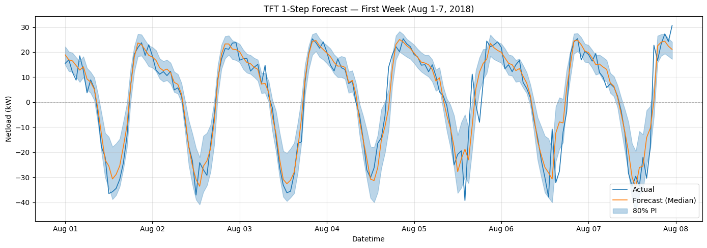
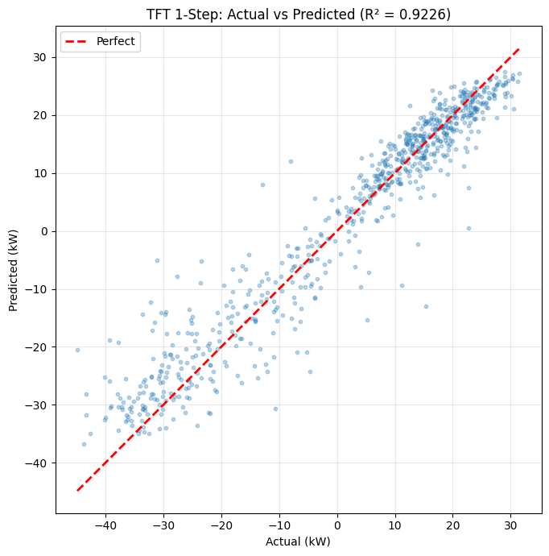

# Residential Net-Load Forecasting

## Overview

This project investigates residential net-load forecasting under high penetration of behind-the-meter solar photovoltaic (PV) systems. The objective is to compare statistical, machine learning, and deep learning models using a unified experimental framework.

## Research Objective

Accurate net-load forecasting is critical for grid reliability, renewable energy integration, and efficient power system operation. This work evaluates multiple forecasting approaches for day-ahead residential net-load prediction.
## Methodology

**Figure:** Experimental framework used to compare statistical, machine learning, and deep learning models with and without feature engineering.

## Dataset

- Source: Pecan Street Dataport
- Location: Austin, Texas
- Data Type:
  - Residential electricity consumption
  - Solar generation
  - Weather variables

## Models Evaluated

### Statistical Models
- ARIMAX
- SARIMAX

### Machine Learning Models
- Gradient Boosting Regressor (GBR)

### Deep Learning Models
- Temporal Fusion Transformer (TFT)

## Feature Engineering

- Historical net-load lags
- Weather variables
- Time-based cyclical features
- Calendar features

## Evaluation Metrics

### Deterministic
- MAE
- RMSE
- R²

### Probabilistic
- CRPS
- Pinball Loss
- Prediction Interval Coverage
## Results

### TFT Forecast Performance

### Model Performance

## Key Findings

- Feature engineering significantly improved forecasting performance.
- TFT with engineered features achieved the best overall performance.
- Model rankings remained stable across multiple training-window lengths.

## Tools and Technologies

- Python
- Pandas
- NumPy
- Scikit-Learn
- PyTorch
- PyTorch Forecasting
- Statsmodels
- Matplotlib

## Thesis

Master of Engineering Science (M.E.S.)
Electrical Engineering
Lamar University

## Author

Tasmina Imam
